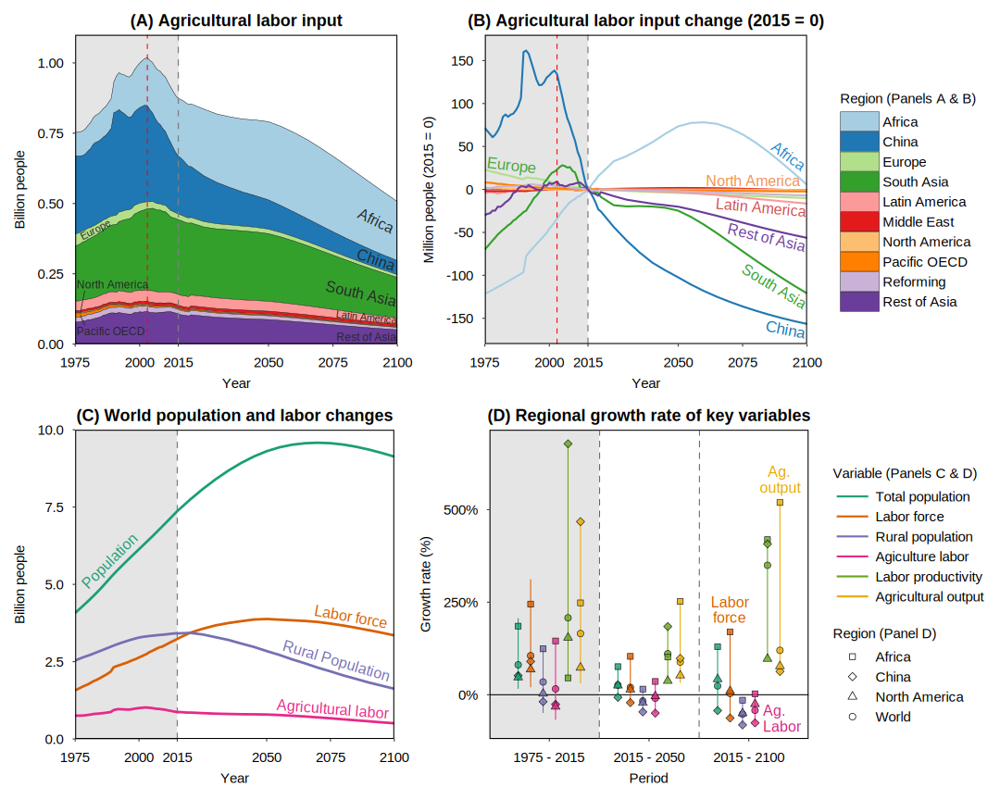
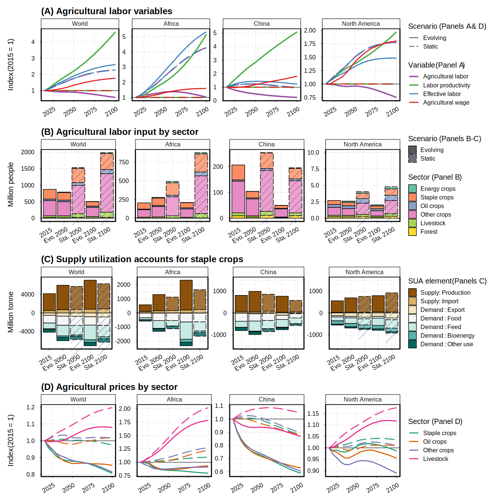
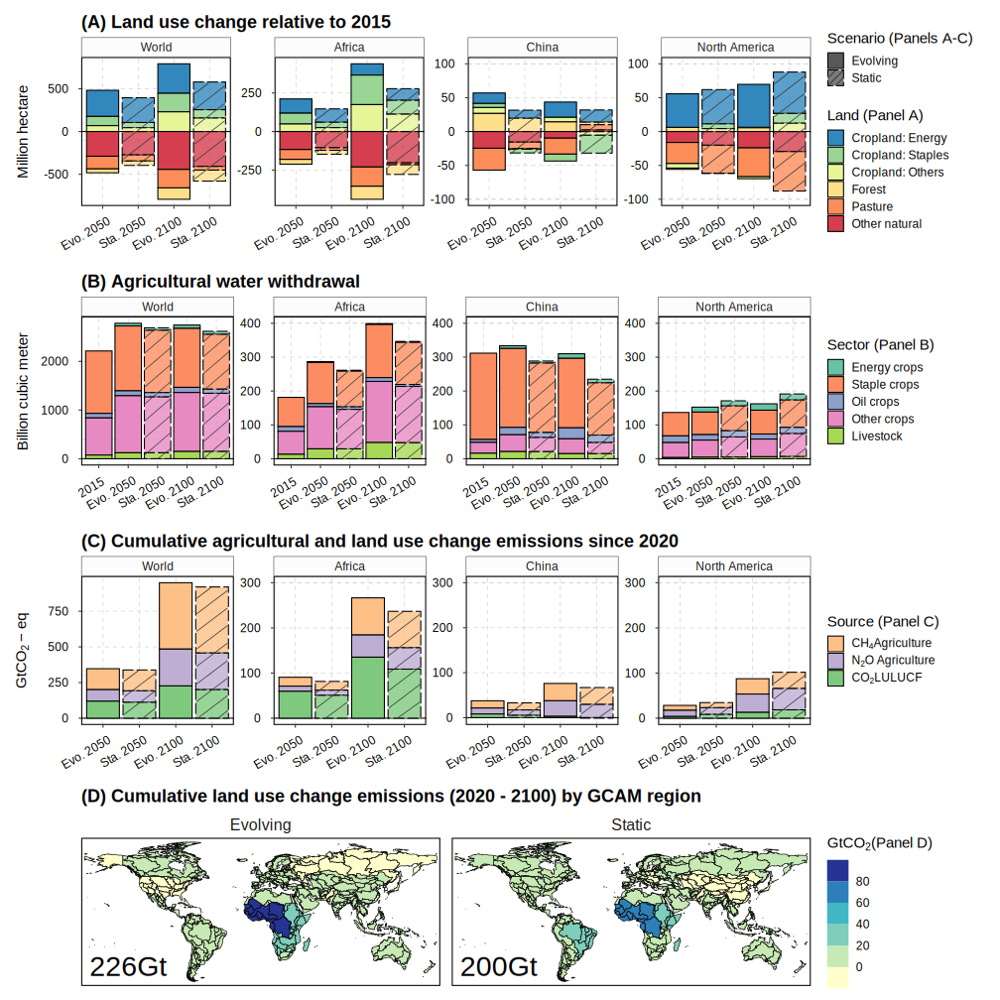

# Overview

This repository includes an R project (R codes, functions, and data) for generating key figures in the paper:

**Agroeconomic and environmental implications of future labor market evolution**  

Di Sheng, James A. Edmonds, Pralit Patel, Stephanie T. Waldhoff, Brian C. O’Neill, Marshall A. Wise, Xin Zhao* 

Joint Global Change Research Institute, Pacific Northwest National Laboratory  
*Corresponding Author. Email: xin.zhao@pnnl.gov


# Instruction
## Access to the data needed
The source csv files (queried from GCAM output database) and the processed RDS data (for ths repo) can be downloaded at the Zenodo archive: 


## Running the R project
Download the entire R project and run `R/main.R`. The script load data and source different R scripts to generate figures or datasets related to historical data and GCAM results. These scripts may further  source and run functions to generate figures and datasets, which will be saved in  `output/AgLabpr/AgLabor`.


## Package output and size
The package output includes figures and datasets (`output/*` included in this repo). 
The size of the output figure folder is about 44MB. 
The ProjectRDS data folder is about 170MB. 
The raw csv data (not required) is about 270MB

## R Session Information (renv used but deacviated)

```
R version 4.1.0 (2021-05-18)
Platform: x86_64-w64-mingw32/x64 (64-bit)
Running under: Windows 10 x64 (build 19045)

Matrix products: default

locale:
[1] LC_COLLATE=English_United States.1252  LC_CTYPE=English_United States.1252   
[3] LC_MONETARY=English_United States.1252 LC_NUMERIC=C                          
[5] LC_TIME=English_United States.1252    

attached base packages:
[1] stats     graphics  grDevices utils     datasets  methods   base     

other attached packages:
 [1] sf_1.0-1           cowplot_1.1.1      RColorBrewer_1.1-2 patchwork_1.1.1    purrr_1.0.1       
 [6] gcamdata_5.1       dplyr_1.0.6        scales_1.1.1       ggsci_2.9          ggplot2_3.3.5     
[11] stringr_1.4.0      tidyr_1.1.3       

loaded via a namespace (and not attached):
 [1] Rcpp_1.0.8.3       pillar_1.7.0       compiler_4.1.0     class_7.3-19       tools_4.1.0       
 [6] digest_0.6.27      lifecycle_1.0.4    tibble_3.1.2       gtable_0.3.0       pkgconfig_2.0.3   
[11] rlang_1.1.0        DBI_1.1.1          cli_3.6.1          rstudioapi_0.13    e1071_1.7-7       
[16] s2_1.0.6           withr_2.5.0        systemfonts_1.0.4  generics_0.1.0     vctrs_0.6.1       
[21] hms_1.1.1          classInt_0.4-3     grid_4.1.0         tidyselect_1.1.1   svglite_2.1.1     
[26] glue_1.4.2         data.table_1.14.0  R6_2.5.0           textshaping_0.3.6  fansi_0.4.2       
[31] farver_2.1.0       readr_1.4.0        magrittr_2.0.1     units_0.7-2        ellipsis_0.3.2    
[36] assertthat_0.2.1   colorspace_2.0-1   ragg_1.2.2         labeling_0.4.2     KernSmooth_2.23-20
[41] utf8_1.2.1         proxy_0.4-26       stringi_1.6.1      wk_0.4.1           munsell_0.5.0     
[46] crayon_1.4.1 
```

Key Figures

Fig. 1 Historical trends and future projections of agricultural labor-related metrics. Panel (A) presents agricultural labor input by region (stacked areas; see Table S2 for the IPCC R10 region mapping), and Panel (B) shows the corresponding changes (lines) over time relative to 2015. Panel (C) presents changes in population and labor-related metrics at the world level. Panel (D) shows the growth rate of key variables by region and period. The point-range plots show values for key regions (shape of the point) and R10 region ranges (whiskers). Vertical dotted lines, where applicable, highlight 2003 (red) and 2015 (gray). Data from 1975 to 2015 (gray background areas) are historical observations compiled based on USDA and ILO data. Annotation is added for key regions and variables. Data after 2015 are projections from the “Evolving” scenario (GCAM) in the current study (agricultural labor, labor productivity, and value output) or the SSP database (population and labor force). The agricultural labor data presented labor in the primary crop, livestock, and forestry production, while labor in the fishery sector (3% globally) is not included.


Fig. 3 Impact of agricultural labor market evolution on key agroeconomic outcomes. Projections from the Evolving and Static scenarios are presented for various agricultural labor market variables (A), labor by sector (B), supply utilization accounts (SUA) for staple crops (C), and agricultural prices (D). Panel (A) shows key agricultural labor market variables (line color) by region (world and 3 key regions in subpanels), and scenario (line type). Panel (B) displays stacked bars decomposing the agricultural labor in Panel (A) by sector (filled color) across scenarios, Evolving (Evo) vs. Static (Sta.), distinguished by filled pattern and transparency, for 2050 and 2100. Panel (C) presents stacked bars depicting the supply (positive values) and demand (negative values) balance (total supply offsets total demand) by region and scenario for 2050 and 2100. Staple crops include GCAM commodities of Wheat, Rice, Corn, OtherGrain, and RootTuber (Table S3). Panel (D) shows the agricultural producer price index (2015 = 1) with breakdowns by region, sector (line color), and scenario (line type). Data source: GCAM simulation results. 


Fig. 4 Impact of agricultural labor market evolution on key environmental outcomes. Projections from the Evolving and Static scenarios are presented for land use change (A), agricultural water withdrawal (B), cumulative emissions from agriculture and Land Use, Land-use Change, and Forestry (LULUCF) (C), along with maps illustrating the cumulative LULUCF emissions (D). In panel (A), stacked bars depict land use change (relative to 2015), decomposed by land type (filled color) across scenarios, Evolving (Evo) vs. Static (Sta.) (distinguished by filled pattern and transparency), by region (world and 3 key regions in subpanels) for 2050 and 2100. Panel (B) displays stacked bars representing agricultural water withdrawal by sector (filled color), and Panel (C) illustrates cumulative greenhouse gas emissions by source (filled color) for the periods 2020 – 2050 and 2020 – 2100. Panel D shows the spatial decomposition of the 2020 – 2100 cumulative LULUCF carbon emissions by GCAM 32 regions, with net total values labeled (e.g., 226 GtCO2 in the Evolving scenario). Data source: GCAM simulation results.
